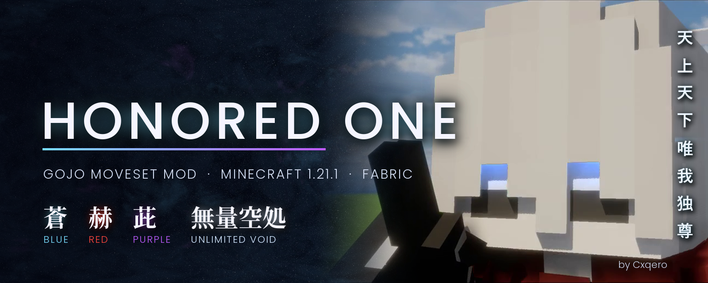

<p align="center">
  
</p>

<h1 align="center">Honored One - Gojo Moveset Mod</h1>

<p align="center">
  <b>Satoru Gojo's Limitless in Minecraft 1.21.1 (Fabric)</b><br>
  custom effects · casting animations · cinematic attacks · shader-pack support
</p>

<p align="center">
  <a href="../../releases"><b>⬇️ Download</b></a> ·
  <a href="../../wiki"><b>📖 Wiki</b></a> ·
  <a href="../../issues"><b>🐞 Report a bug</b></a>
</p>

---

## AI disclaimer
This mod was made with the help of **Claude Opus 5.5**. I know many in the Minecraft modding scene, both modders and
users, have a distaste for it, but I personally love having my ideas made into actual things with it. If you have
problems with AI, please don't harass me over it. Share any bugs or problems in the [Issues](../../issues) tab and I'll
have them fixed. Give suggestions for the next mod and I'll take it all into account. Anything is possible with today's
AI tools.

And for anyone naturally skeptical of what AI has made, or worried I slipped in anything malicious: **this repository is
public and has every file.** Check it out for yourself, or [build the jar yourself](#build-it-yourself).

---

Bring Gojo's Limitless techniques into **Minecraft 1.21.1 on Fabric**, complete with custom effects, casting animations
and cinematic attacks. Pull enemies into Blue, send them flying with Red, or erase a path through the landscape with
Hollow Purple.

### Lapse Blue · `R`
Tap to create a singularity that pulls in nearby enemies. Hold for **Maximum Output Blue**, an orb that circles you and
grows, tearing up the land. Let go to raise it overhead and let it disperse (or throw it, in the settings).


### Reversal Red · `G`
Fire a blast of repulsive force that knocks enemies back. Hold for the incantation-powered Red with a much bigger impact.


### Hollow Purple · `V`
Combine Blue and Red into a destructive projectile that tears through enemies and terrain. Hold for the full incantation
and **200% Hollow Purple**.

 

### Hollow Purple Nuke · `B`
Bring Blue and Red together above your target for a massive cinematic detonation.


### Unlimited Void · `Z`
Trap nearby enemies in your domain and leave them paralysed. Tap for the **0.2-second domain**, or hold for the full
expansion.

 

### Infinity · `N`
Slow incoming projectiles to a stop and protect yourself from melee attacks and explosions. Enabled by default; press `N`
to toggle.

---

### Make it yours
The scale of these moves, especially the 200% Hollow Purple and the Hollow Purple nuke, is massive, so for a more
lore-friendly playthrough adjust them in the settings.

Rebind the controls, adjust damage and destruction, or tune visual quality and camera effects. Press `Enter` to skip
cutscenes.

**Terrain destruction is enabled by default**, so check your settings before casting near anything you want to keep.

### Installation
Requires **Minecraft Java 1.21.1**, **Fabric Loader 0.16+** and **[Fabric API](https://modrinth.com/mod/fabric-api)**.
Player Animator and bendy-lib are bundled. Install **[Mod Menu](https://modrinth.com/mod/modmenu)** +
**[YACL](https://modrinth.com/mod/yacl)** for the in-game settings screen.

Settings are also in `config/gojolimitless.json`. Full guide: [the wiki](../../wiki/Installation).

*Made for singleplayer. Unofficial Jujutsu Kaisen fan project.*

---

## Build it yourself
Don't want to trust a downloaded jar? Build your own from this exact source. You need a **JDK 21** or newer.

```
cd mod
gradlew.bat build        (Windows)
./gradlew build          (macOS / Linux)
```

The jar lands in `mod/build/libs/`. Gradle's download is checksum-pinned in `mod/gradle/wrapper/gradle-wrapper.properties`.

**What the mod does on your computer:** reads and writes `config/gojolimitless.json` and changes your world when you
cast. That's it: no network access, no telemetry, no downloads. Search the code for `http`, `URL` or `Socket` and see
for yourself.

## What's in this repository
| Path | Contents |
|---|---|
| `mod/` | the Fabric mod (Gradle project). `src/main` runs on both sides, `src/client` on your client only |
| `mod/src/main/resources/assets/` | every texture, sound, animation, camera track and cutscene frame |
| `blender/` | the Blender scripts that render every texture, animation, camera track and insert |
| `audio/` | the Python scripts that synthesize every sound effect |
| `docs/` | the technical plan, the lore bible and the cutscene storyboards |
| `wiki/` | the source of the [wiki](../../wiki) |
| `tools/` | build, test and recording helpers |
| `MODLOG.md`, `PROGRESS.md`, `CHANGES_*.md` | the development journal, from the first checkpoint on |
| `## Gojo Satoru - Limitless v*.txt` | the changelog |

## Credits
- [Fabric](https://fabricmc.net/) Loader, API and Loom
- [Player Animator](https://github.com/KosmX/minecraftPlayerAnimator) (MIT) and [bendy-lib](https://github.com/KosmX/bendy-lib) (CC-BY-4.0) by KosmX, bundled for the casting animations
- [YetAnotherConfigLib](https://github.com/isXander/YetAnotherConfigLib) by isXander and [Mod Menu](https://github.com/TerraformersMC/ModMenu) by TerraformersMC, for the settings screen
- [Sodium](https://github.com/CaffeineMC/sodium) and [Iris](https://github.com/IrisShaders/Iris), supported and tested
- Effects, cutscenes and animations made with [Blender](https://www.blender.org/); sounds synthesized in Python
- Fonts in the title cards: [Poppins](https://github.com/itfoundry/Poppins) and [Noto Serif JP](https://github.com/notofonts/noto-cjk), SIL Open Font License (licenses in `blender/fonts/`)
- Built with **Claude Opus 5.5** (Anthropic)
- *Jujutsu Kaisen* is by Gege Akutami. This is an unofficial fan project, not affiliated with or endorsed by its creators or publishers

## License
© 2026 **Cxqero**. All rights reserved. The source is public so anyone can read it, check it and build it for their
own use. Please ask before reusing or redistributing it.
